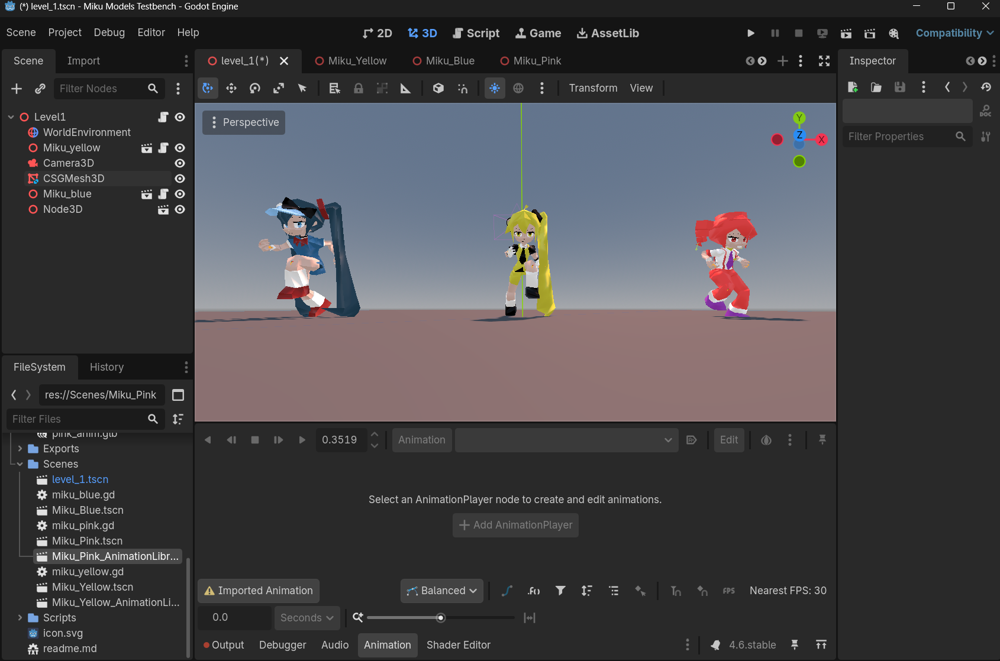
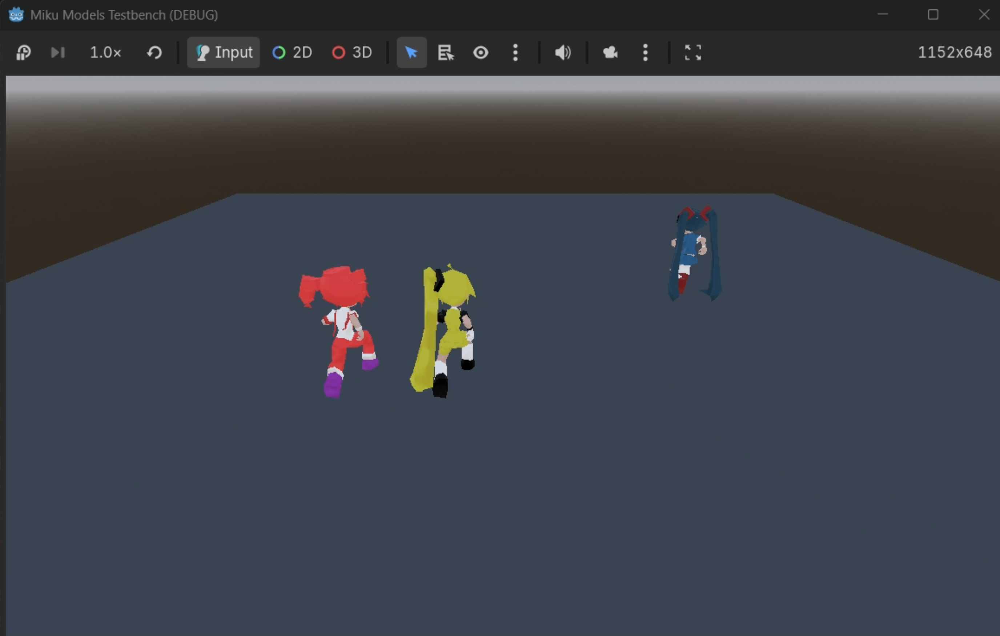
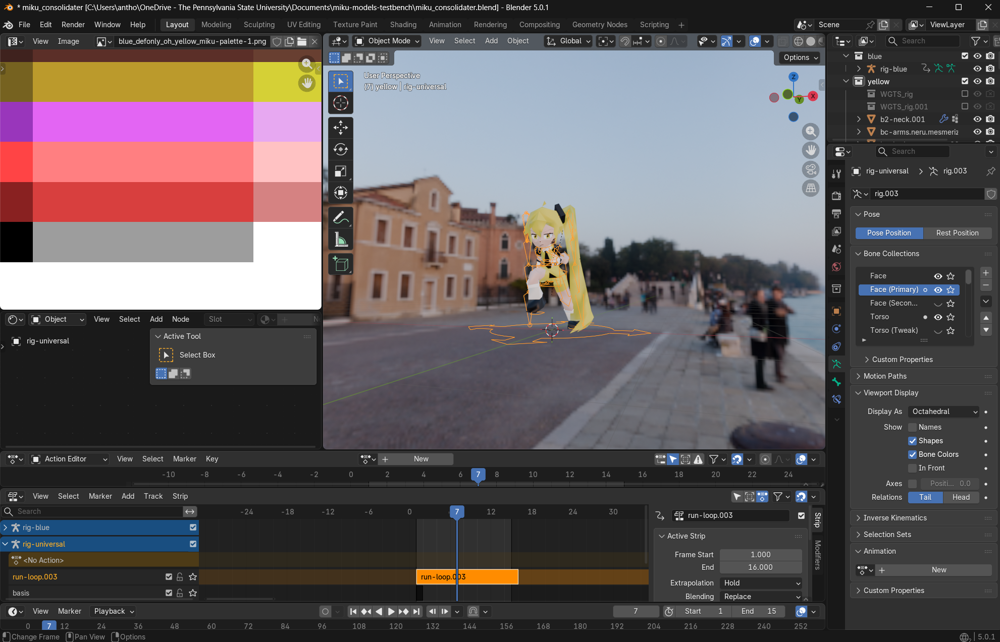
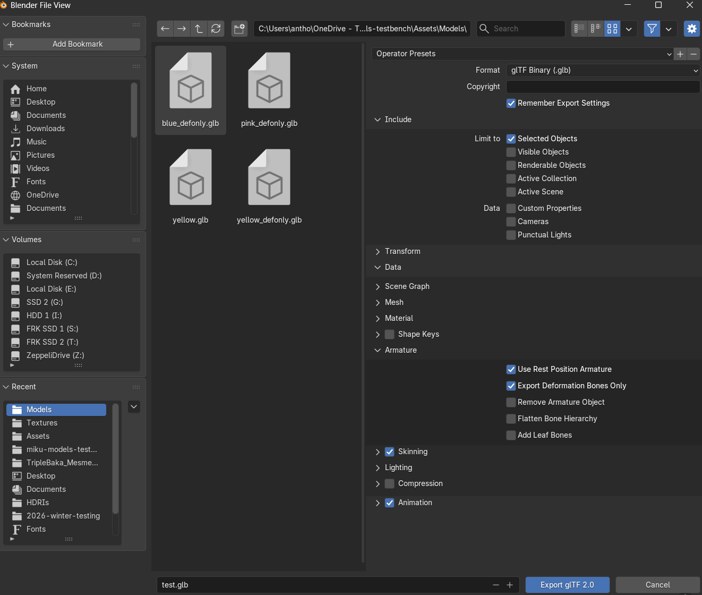
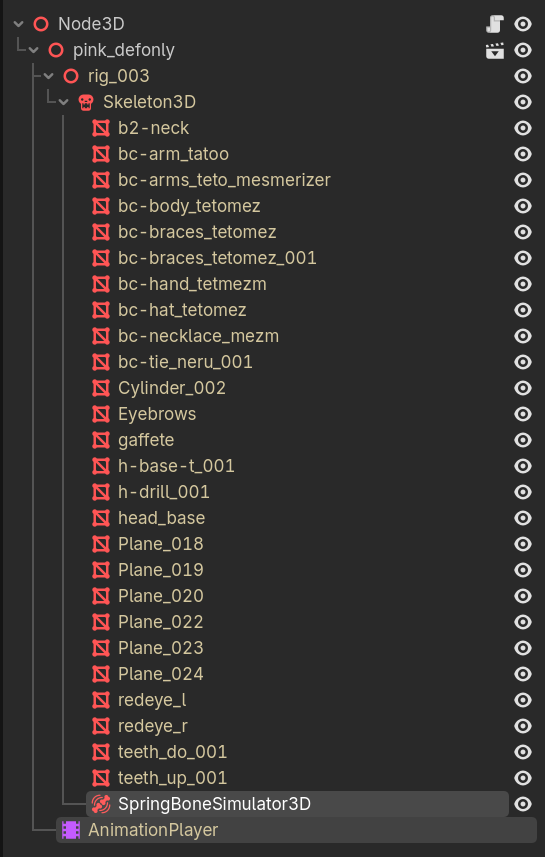

# Miku Models Universal Rig Testbench

### Includes
 - re-textured, re-topologized, re-rigged models (originals from https://open3dlab.com/project/4b49c53a-946a-4a7a-97fa-2859720448d2/ by Camad — Beerware license)

 - Godot (4.6 stable) project with test scenes, spring bones, and code to test the hair bounciness

 - Blender (5.0.1) project with UV maps, textures, rigs, and animations

### Godot

### Blender

## Process

1. export glb of animated model with the universal rig (using 'deform bones only' lately)

2. import into godot
3. duplicate it
4. change one's 'import' tab settings (after importing, next to the 'scene' tab) for the glb from 'scene' to 'animation library'
5. drag the other into a new scene
6. delete the existing 'animation player' (requires both 'editable children' and 'make local')
7. add a new animation player to the same spot (direct child of the base glb (not the Node3d))
8. with that animation player, select the animation button (within the animation window from the animation tab at the bottom of the editor) and click 'manage animations'
9. click "load library" and select the .glb file that was converted to an animation library in step #4 (check animations are working)
10. add a SpringBoneSimulator3D node to the scene (direct child of the Skeleton3D)
11. selected the hair start and stop bones unique to that model (bones in the universal rig named with the related model's hair color)

